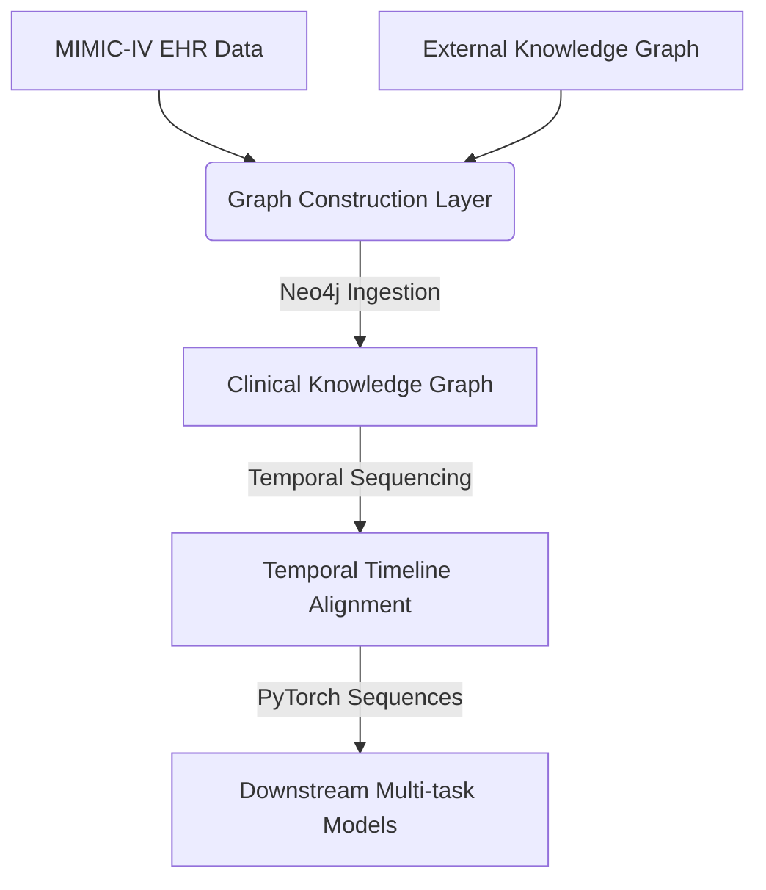

# Patient EHR Graph Representation for Multi-task Learning

A state-of-the-art research pipeline and platform that constructs a structured **Clinical Knowledge Graph** from patient Electronic Health Records (EHR) and external medical ontologies. This representation serves as a robust foundation for multi-task deep learning models (predicting mortality, length of stay, readmission, etc.) and is exposed through a rich, interactive web application.

---

## 🌟 Core Architecture Overview

The system operates across three interconnected layers designed to bridge raw medical databases with advanced neural representations:



1. **Heterogeneous Knowledge Graph:** Integrates internal patient EHR records (admissions, transfers, lab events, prescriptions, notes) with external knowledge ontologies (drug-drug, disease-disease, and phenotypes).
2. **GNN/GAT Representation Learning:** Leverages Graph Attention Networks (GAT) to enrich admission and clinical event representations, capturing deep semantic relationships between diagnoses and drugs.
3. **Temporal Multi-task Sequence Modeling:** Aligns events chronologically into dense patient timelines (`patient_timelines.pt`) to train sequence models (RNNs/Transformers) on downstream clinical outcomes.

---

## 📁 Repository Map

Below is the updated layout of the codebase, outlining the logical separation of core processing pipelines, local data caches, model definitions, and the full-stack visualization web app.

```
.
├── App/                          # Full-Stack Web Application
│   ├── backend/                  # FastAPI REST API Backend
│   └── frontend/                 # React + Vite Frontend
│
├── data/                         # Local Data Storage & Artifacts (Ignored / Cached)
│
├── modules/                      # Core Pipeline, Preprocessing, and Machine Learning Modules
│   ├── dataset_preprocessing/    # Preprocessing Pipelines (Cleaning & Standardization)
│   │   ├── external/             # Mappings for external medical ontologies (OMOP, RXNORM)
│   │   ├── mimic/                # Cleaning, filtering, and standardizing MIMIC-IV raw tables
│   │   └── utils.py              # Text cleaning and preprocessing helper utilities
│   │
│   ├── graph_construction/       # Neo4j Ingestion & Graph Snapshot Creation
│   │   ├── enrich/               # scripts enriching Neo4j with disease-disease and drug links
│   │   ├── nodes/                # Loader scripts for admissions, transfers, and clinical nodes
│   │   ├── graph_snapshot.py     # Database orchestrator dumping schema/snapshots
│   │   └── post_check.cypher     # Cypher validation queries ensuring graph integrity
│   │
│   ├── models/                   # GNN-Based Entity Representation Models
│   │   ├── preparation/          # PyTorch Geometric dataset loaders and preparation scripts
│   │   ├── models.py             # Neural network definitions (GAT-based AdmissionEncoder)
│   │   ├── extractor.py          # Neo4j sub-graph extraction and feature parsing utility
│   │   ├── diagnosis_training.py # GNN trainer optimizing diagnosis embeddings
│   │   ├── procedure_training.py # GNN trainer optimizing clinical procedure embeddings
│   │   ├── diagnosis_testing.py  # Model evaluation code for diagnosis embeddings
│   │   └── test_full.py          # E2E validation script for the GNN framework
│   │
│   ├── downstream/               # Multi-Task Patient Sequence Modeling (RNN/Transformer)
│   │   ├── presetup/             # Patient cohort definition, demographic and diagnosis filters
│   │   ├── clustering_ablation/  # Embedding clustering validations and ablation checks
│   │   ├── temporal_sequence_setup/ # Aligning temporal admission events into timeline sequences
│   │   └── training/             # Multi-task outcome models (Mortality, LOS, Readmission)
│   │
│   └── test/                     # Debugging & Verification Scripts
│
├── notebooks/                    # Jupyter Experimentation Playgrounds
├── plan/                         # Architecture Blueprints & Implementation Roadmaps
├── secrets/                      # Local API Keys, service credentials (never committed)
├── shared_functions/             # Global Helper Functions & Third-Party APIs
│
├── .env.example                  # Environment template variable list
├── .gitignore                    # Git file exclusion rules
└── requirements.txt              # Core Python dependencies
```

---

## 🛠️ Getting Started

### 1. Clone the Repository

```bash
git clone https://github.com/GinHikat/Patient-EHR-Graph-Representation-for-Multi-task-Learning.git
cd Patient-EHR-Graph-Representation-for-Multi-task-Learning
```

### 2. Set Up Environment Variables

Copy the example `.env` file and customize the variables to match your system credentials:

```bash
cp .env.example .env
```

Ensure you provide correct paths and connection strings:

```ini
# Core Directories
DATA_DIR=d:/Study/Education/Projects/Thesis/data

# Google Cloud Integration (Logging/Metrics tracking via Sheets)
GOOGLE_API_CREDS=secrets/ggsheet_credentials.json
GOOGLE_SHEET_ID=your_sheet_id
GOOGLE_DRIVE_ID=your_drive_id

# LLM / Embedding Keys
OPENAI_API_KEY=your_openai_key
GOOGLE_API_KEY=your_google_ai_key

# Neo4j Database Configuration
NEO4J_URI=bolt://localhost:7687
NEO4J_USERNAME=neo4j
NEO4J_AUTH=your_password
NEO4J_DATABASE=neo4j
```

### 3. Install Python Dependencies

For hyper-fast, reliable installation, it is recommended to use [`uv`](https://github.com/astral-sh/uv):

```bash
# Install uv locally
pip install uv

# Sync environment dependencies
uv pip install -r requirements.txt
```

*Or standard pip:*

```bash
pip install -r requirements.txt
```

---

## 🚀 Running the Pipeline

### Step A: Dataset Preprocessing & Graph Construction

Ingest and clean raw MIMIC data, map external ontologies, and ingest entities/relations into Neo4j:

```bash
# Ingest nodes and enrich linkages in Neo4j
python modules/graph_construction/graph_snapshot.py
```

### Step B: Train the GNN Graph Representation Models

Run the Graph Attention Network (GAT) models to generate dense embeddings for medical entities:

```bash
# Train diagnosis embeddings
python modules/models/diagnosis_training.py

# Train procedure embeddings
python modules/models/procedure_training.py
```

### Step C: Compile Patient Timelines

Construct unified multi-modal timeline sequence tensors:

```bash
# Setup patient timelines
python modules/downstream/temporal_sequence_setup/temporal_modeling.py
```

### Step D: Downstream Multi-Task Training

Train deep learning networks (RNN/Transformer) to predict mortality, readmission, and ICU length of stay:

```bash
# Train multi-task EHR models
python modules/downstream/training/EHR_training.py
```

---

## 🖥️ Running the Visualization Web Application

### 1. Launch the FastAPI Backend

```bash
cd App/backend
python main.py
```

* The API will run locally at `http://localhost:8000`.
* Explore interactive Swagger docs at `http://localhost:8000/docs`.

### 2. Launch the React + Vite Frontend

```bash
cd App/frontend
npm install
npm run dev
```

* The frontend development server will launch at `http://localhost:5173`.
* You can also access the cloud-deployed application directly: `https://patient-ehr-graph.vercel.app`. *(Note: Hosted on free-tier Render/Vercel services; cold start times may apply.)*

---

## 🧪 Verification & Testing

Verify that your local dataset is completely aligned, containing no NaN/Null tensors, and has healthy sequence distributions:

```bash
# Check loaded timelines for NaNs/null values
python modules/test/audit_nans.py

# Verify chronological alignment and formatting of timelines
python modules/test/test_timeline.py

# Analyze sequence length distributions across cohorts
python modules/test/event_length.py
```

To run the API and backend integration tests:

```bash
cd App/backend
python -m pytest test
```

---

## 📊 Prerequisites & Versions

| Component            | Version / Requirement                                                  |
| -------------------- | ---------------------------------------------------------------------- |
| **Python**     | `3.10+`                                                              |
| **Node.js**    | `v16+` (npm `v8+`)                                                 |
| **Neo4j**      | Local database or Aura Cloud instance (ensure APOC plugins are active) |
| **CUDA Cores** | Strongly recommended for downstream deep learning models               |
