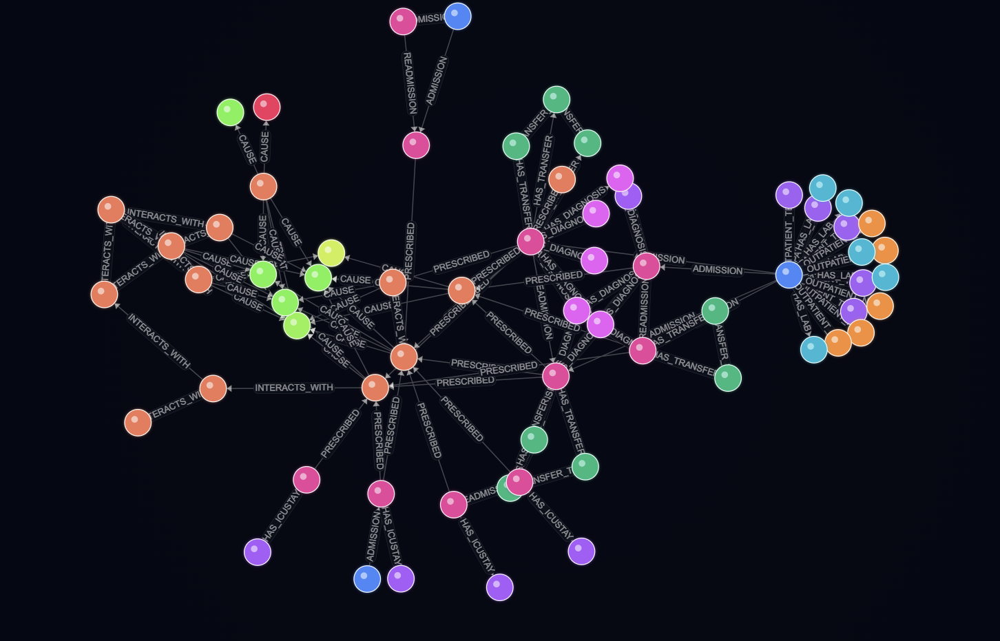
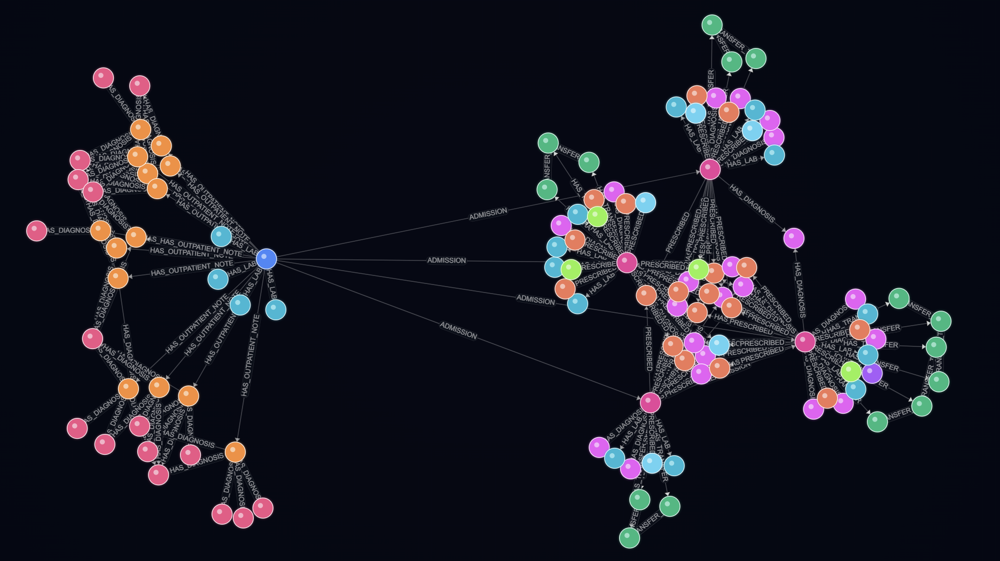

<div align="center">

# Patient EHR Graph Representation for Multi-task Learning

<p align="center">
  <a href="https://patient-ehr-graph.vercel.app"></a>
  <a href="http://localhost:8000/docs"></a>
  <a href="https://neo4j.com"></a>
  <a href="https://github.com/GinHikat/Patient-EHR-Graph-Representation-for-Multi-task-Learning"></a>
  <a href="LICENSE"></a>
</p>

**A state-of-the-art clinical research pipeline constructing a structured Clinical Knowledge Graph from patient Electronic Health Records (MIMIC-IV) and external medical ontologies for multi-task deep learning.**

</div>

---

## 💡 Abstract & System Architecture

Translating patient Electronic Health Records (EHR) into predictive clinical models requires capturing both static semantic relationships (drug interactions, disease hierarchies) and temporal dynamic sequences (admission events, lab trends).

```
+-------------------+     +---------------------+     +----------------------+     +-----------------------+
| MIMIC-IV EHR Data | --> | Clinical Knowledge  | --> | Temporal Timeline    | --> | Downstream Multi-Task |
| & Medical Ontologies|   | Graph (Neo4j & GAT) |     | Sequence Alignment   |     | Deep Models (RNN/Transformer)
+-------------------+     +---------------------+     +----------------------+     +-----------------------+
```

### 3-Layer System Breakdown

| Layer | Component | Function & Architecture |
| --- | --- | --- |
| **Layer 1** | **Heterogeneous Knowledge Graph** | Integrates internal patient EHR records (admissions, transfers, lab events, prescriptions) with external ontologies (drug-drug, disease-disease). |
| **Layer 2** | **GNN / GAT Representation Learning** | Leverages Graph Attention Networks (GAT) to enrich admission and clinical event representations with semantic graph embeddings. |
| **Layer 3** | **Temporal Sequence Modeling** | Aligns events chronologically into dense patient timelines (`patient_timelines.pt`) for multi-task mortality, readmission, and prescription prediction. |

---

## 🕸️ Knowledge Graph Scale & Statistics

Our constructed Clinical Knowledge Graph scales across **11.4 Million+ Nodes** and **28.2 Million+ Edges**, establishing a comprehensive semantic network linking patient EHR records with medical ontologies:

<div align="center">

| Metric | Scale Count | Description |
| :--- | :---: | :--- |
| 🌐 **Total Graph Nodes** | **11,469,116** | Combined MIMIC-IV clinical entities & external ontology nodes |
| 🔗 **Total Graph Edges** | **28,276,419** | Semantic relations connecting admissions, diagnoses, labs & drugs |
| 🏥 **MIMIC Clinical Nodes** | **11,032,862** | Patient admissions, transfers, lab events, prescriptions |
| 📚 **External Ontology Nodes** | **238,628** | Disease-disease interactions, drug-drug pathways, phenotypes |
| 🩺 **ICD Diagnosis Nodes** | **772** | Standardized medical diagnosis classifications |

</div>

<div align="center">

| Relationship Type | Edge Count | Clinical Description |
| :--- | :---: | :--- |
| `HAS_DIAGNOSIS` | **8,324,544** | Links patient admissions to diagnosed ICD disease codes |
| `HAS_LAB` | **5,952,167** | Connects admissions to laboratory test measurements |
| `HAS_TRANSFER` | **1,532,893** | ICU and hospital ward transfer progression |
| `OUTPATIENT_TEST` | **1,529,706** | Outpatient clinic test results & procedures |
| `CHILD_OF` | **299,180** | Ontological disease hierarchy relationships |
| `CAUSE` | **108,867** | Causal connections between disease mechanisms |
| `HAS_ICUSTAY` | **62,445** | Intensive Care Unit stay records |

</div>

---

## 🎨 Knowledge Graph Visualizations

<div align="center">

### Connected Patient Graph with External Knowledge Graph


<br/><br/>

### Full Subgraph for a Patient


</div>

---

## 📊 Quantitative Results & Benchmarks

The proposed clinical patient representation framework is evaluated across **four per-admission tasks** using the MIMIC-IV dataset and compared against **nine recent state-of-the-art (SOTA) clinical machine learning methods** (2022–2025):

| Model / Paper Reference | Mortality AUROC | Mortality AUPR | Readmission AUROC | Readmission AUPR | Drug Rec AUROC | Drug Rec AUPR | Diag Prog AUROC | Diag Prog AUPR |
| :--- | :---: | :---: | :---: | :---: | :---: | :---: | :---: | :---: |
| **This work (Patient EHR Graph)** | **0.99** | **0.79** | 0.89 | **0.79** | 0.77 | 0.50 | 0.87 | **0.20** |
| Daphne et al. (2025) | 0.93 | 0.65 | **0.95** | 0.75 | — | — | — | — |
| Deng et al. (2022) | 0.87 | — | 0.64 | — | — | — | — | — |
| Chan et al. (2024) | 0.71 | 0.05 | 0.69 | 0.70 | **0.98** | 0.70 | — | — |
| Jiang et al. (2023) [GraphCare] | 0.73 | 0.07 | 0.82 | — | 0.95 | **0.77** | — | — |
| Gupta et al. (2022) | 0.87 | 0.55 | 0.77 | 0.55 | — | — | — | — |
| Rohr et al. (2024) | — | — | — | — | — | — | 0.87 | 0.17 |
| Chen et al. (2025) | 0.86 | 0.33 | 0.74 | 0.27 | — | — | — | — |
| Bui et al. (2024) | 0.87 | 0.52 | — | — | — | — | — | — |
| Yang et al. (2024) [MPLite] | — | — | — | — | — | — | **0.88** | — |

---

## 📂 Repository Structure

```text
Patient-EHR-Graph/
├── App/                          # Full-Stack Visualization Platform
│   ├── backend/                  # FastAPI ASGI Server
│   └── frontend/                 # React + Vite UI Workbench
├── data/                         # Local Data Storage & Artifacts (Ignored / Cached)
├── docs/                         # GitHub Pages Interactive Showcase Site
│   ├── assets/                   # Graph visual outputs & statistics graphics
│   └── index.html                # Interactive Web Demo UI
├── modules/                      # Business Logic & Pipeline Architecture
│   ├── dataset_preprocessing/    # Preprocessing Pipelines
│   │   ├── external/             # Mappings for external medical ontologies 
│   │   ├── mimic/                # Cleaning, filtering, and standardizing MIMIC-IV raw tables
│   │   └── utils.py              # Text cleaning and preprocessing helper utilities
│   ├── graph_construction/       # Neo4j Ingestion & Graph Snapshot Creation
│   │   ├── enrich/               # Scripts enriching Neo4j with disease-disease and drug links
│   │   ├── nodes/                # Loader scripts for admissions, transfers, and clinical nodes
│   │   ├── graph_snapshot.py     # Database orchestrator dumping schema/snapshots
│   │   └── post_check.cypher     # Cypher validation queries ensuring graph integrity
│   ├── models/                   # Clinical Note Extraction models and training scripts
│   └── downstream/               # Multi-Task Patient Sequence Modeling (RNN/Transformer)
│       ├── presetup/             # Patient cohort definition, demographic and diagnosis filters
│       ├── clustering_ablation/  # Embedding clustering validations and ablation checks
│       ├── temporal_sequence_setup/ # Aligning temporal admission events into timeline sequences
│       └── training/             # Multi-task outcome models 
├── shared_functions/             # Global Helper Utilities & Third-Party APIs
├── VAR/                          # Vietnamese Clinical Entity Extraction Pipeline
├── .env.example                  # Environment configuration template
├── requirements.txt              # Python dependencies
└── README.md                     # Project documentation
```

---

## ⚡ Setup & Quick Start

### 1. Environment Setup

```bash
# Clone repository
git clone https://github.com/GinHikat/Patient-EHR-Graph-Representation-for-Multi-task-Learning.git
cd Patient-EHR-Graph-Representation-for-Multi-task-Learning

# Install dependencies using uv (recommended)
pip install uv
uv pip install -r requirements.txt
```

### 2. Environment Variables Configuration

Copy the template `.env.example` to `.env` and set your credentials:

```bash
cp .env.example .env
```

```ini
# Data Directory
DATA_DIR=d:/Study/Education/Projects/Thesis/data

# Neo4j Database Connection
NEO4J_URI=bolt://localhost:7687
NEO4J_USERNAME=neo4j
NEO4J_AUTH=your_password
NEO4J_DATABASE=neo4j

# API Keys
OPENAI_API_KEY=your_openai_key
GOOGLE_API_KEY=your_google_ai_key
```

### 3. Launching Visualization Application

**Launch FastAPI Backend:**

```bash
cd App/backend
python main.py
```

*Backend REST service runs at `http://localhost:8000` with Swagger docs at `http://localhost:8000/docs`*

**Launch React Frontend:**

```bash
cd App/frontend
npm install
npm run dev
```

*Frontend workbench runs at `http://localhost:5173` or access live deployment at `https://patient-ehr-graph.vercel.app`*

---

## 🚀 Current Progress & Future Roadmap: Vietnamese EHR Graph Bridge
 **Vietnamese Clinical Entity Extraction**:
  - Processing unstructured Vietnamese clinical notes to extract 5 core entity labels: `CHẨN_ĐOÁN` (Diagnosis), `THUỐC` (Medication), `TÊN_XÉT_NGHIỆM` (Procedure), `TRIỆU_CHỨNG` (Symptom), and `KẾT_QUẢ_XÉT_NGHIỆM` (Lab Result).
  - Fine-tuning **Clinical BERT NER** for entity boundary detection and **SapBERT** for zero-shot cosine similarity linking to international ontologies (**ICD-10** & **RxNorm**).
  - Building a cross-lingual bridge to construct the **Vietnamese Clinical EHR Knowledge Graph**.

---

## 📜 Citation

> Currently no academic paper citation yet, but hopefully will be published soon!
