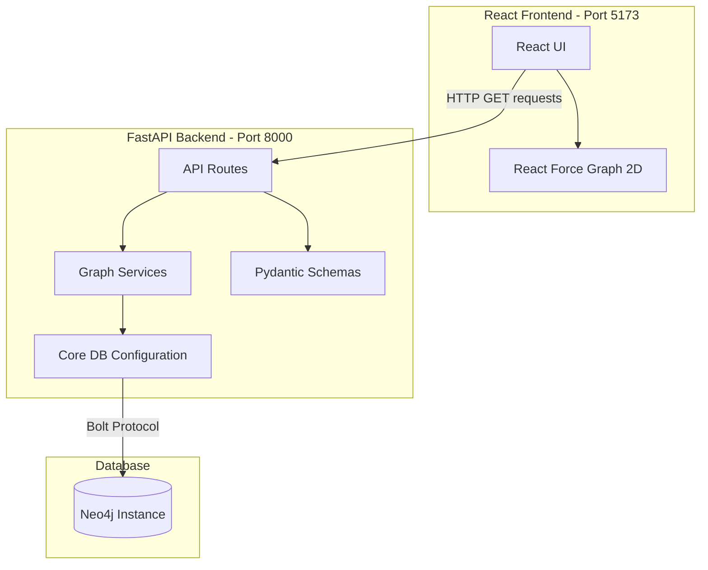

# Neo4j Graph Explorer

A full-stack application for visualizing and exploring Neo4j graph databases. The system retrieves nodes, relationships, and metadata from Neo4j and renders them in an interactive 2D graph format using React Force Graph.

## 🏗️ System Architecture

The application is built with a modern stack separated into a frontend client and backend API.



### Components Summary:

* **Frontend**: Built using React and Vite. It heavily relies on `react-force-graph-2d` for generating the nodes and relationships. Data is fetched via standard HTTP requests (Axios).
* **Backend**: Built using FastAPI (Python). It is modularized into endpoints (`api`), business logic (`services`), request/response verification (`schemas`), and database/system config initialization (`core`). Tests use `pytest`.
* **Database**: Connects to any accessible Neo4j graph instance utilizing standard Neo4j Python drivers reading configuration variables from an environment file.

---

## 🚀 How to Run the System

### 1. Prerequisites

Ensure you have the following installed:

* [Node.js](https://nodejs.org/) (v16.x or newer) and `npm`
* [Python](https://www.python.org/downloads/) (3.10 or newer)
* A running **Neo4j database instance** (local Desktop, Docker, or Aura).

### 2. Configure Environment variables

Navigate to the root directory `d:\Study\Education\Projects\Thesis` (or adjacent to where `App/` exists) and ensure there is a `.env` file containing the connection string and credentials for your database:

```ini
NEO4J_URI=bolt://localhost:7687  # or neo4j+s://... for aura
NEO4J_USERNAME=neo4j
NEO4J_AUTH=your_password
```

---

### 3. Running the Backend Server

The backend requires Fast API, Uvicorn, and Neo4j drivers. It dynamically utilizes your `.env` configuration.

1. Open a terminal and navigate to the backend directory:
   ```bash
   cd App/backend
   ```
2. Install the necessary Python packages (preferably inside a virtual environment):
   ```bash
   pip install -r requirement.txt
   ```
3. Start the FastAPI server using Python:
   ```bash
   python main.py
   ```

   *The backend will now be actively listening to requests on `http://localhost:8000`*

---

### 4. Running the Frontend Application

The frontend uses Vite as the build tool and development server.

1. Open a new terminal and navigate to the frontend directory:
   ```bash
   cd App/frontend
   ```
2. Install the required Node dependencies:
   ```bash
   npm install
   ```
3. Start the Vite development server:
   ```bash
   npm run dev
   ```

   *The frontend will typically be accessible via a browser at `http://localhost:5173`*

---

## 🧪 Testing the Backend

You can easily execute Unit, Ablation, and System testing suites utilizing `pytest`. These are constructed using standard Python mocking objects to secure tests during active data modification processes.

1. Verify you are inside the backend directory.

   ```bash
   cd App/backend
   ```
2. Run pytest targeting the test directory:

   ```bash
   python -m pytest test
   ```

   or simply
   ```bash
   pytest
   ```

You will see the output detailing `test_graph_service.py` (Unit), `test_ablation.py` (Ablation), and `test_api.py` (System) successfully executed.
