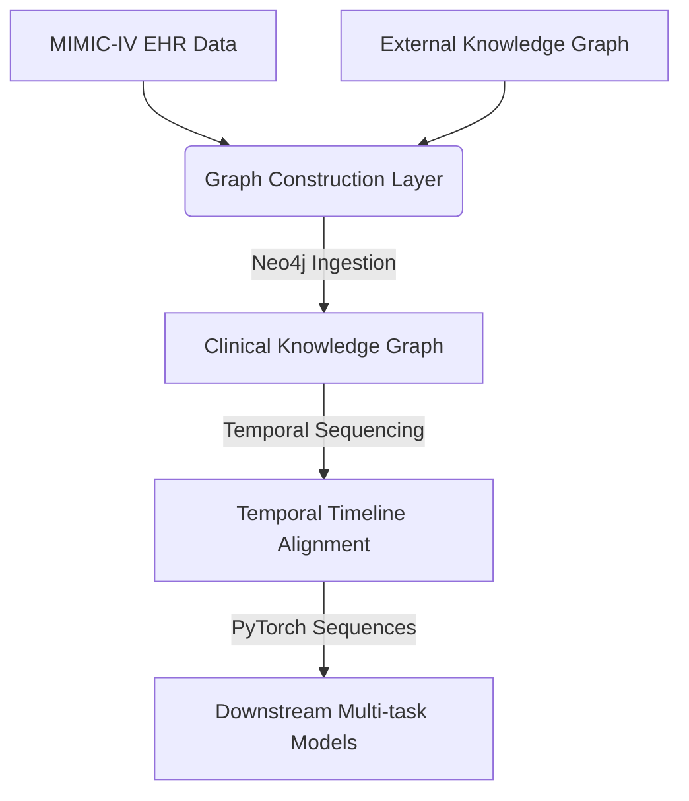

# Patient EHR Graph Representation for Multi-task Learning

A state-of-the-art research pipeline and platform that constructs a structured **Clinical Knowledge Graph** from patient Electronic Health Records (EHR) and external medical ontologies. This representation serves as a robust foundation for multi-task deep learning models (predicting mortality, length of stay, readmission, etc.) and is exposed through a rich, interactive web application.

---

## Core Architecture Overview

The system operates across three interconnected layers designed to bridge raw medical databases with advanced neural representations:



1. **Heterogeneous Knowledge Graph:** Integrates internal patient EHR records (admissions, transfers, lab events, prescriptions, notes) with external knowledge ontologies (drug-drug, disease-disease, and phenotypes).
2. **GNN/GAT Representation Learning:** Leverages Graph Attention Networks (GAT) to enrich admission and clinical event representations, capturing deep semantic relationships between diagnoses and drugs.
3. **Temporal Multi-task Sequence Modeling:** Aligns events chronologically into dense patient timelines (`patient_timelines.pt`) to train sequence models (RNNs/Transformers) on downstream clinical outcomes.

---

## Repository Structure

Below is the layout of the codebase, outlining the logical separation of core processing pipelines, local data caches, model definitions, and the full-stack visualization web app.

```
.
├── App/                          
│   ├── backend/                  # FastAPI Backend
│   └── frontend/                 # React + Vite Frontend
│
├── data/                         # Local Data Storage & Artifacts (Ignored / Cached)
│
├── modules/                      
│   ├── dataset_preprocessing/    # Preprocessing Pipelines
│   │   ├── external/             # Mappings for external medical ontologies 
│   │   ├── mimic/                # Cleaning, filtering, and standardizing MIMIC-IV raw tables
│   │   └── utils.py              # Text cleaning and preprocessing helper utilities
│   │
│   ├── graph_construction/       # Neo4j Ingestion & Graph Snapshot Creation
│   │   ├── enrich/               # Scripts enriching Neo4j with disease-disease and drug links
│   │   ├── nodes/                # Loader scripts for admissions, transfers, and clinical nodes
│   │   ├── graph_snapshot.py     # Database orchestrator dumping schema/snapshots
│   │   └── post_check.cypher     # Cypher validation queries ensuring graph integrity
│   │
│   ├── models/                   # Note Extraction models and training scripts
│   ├── downstream/               # Multi-Task Patient Sequence Modeling (RNN/Transformer)
│   │   ├── presetup/             # Patient cohort definition, demographic and diagnosis filters
│   │   ├── clustering_ablation/  # Embedding clustering validations and ablation checks
│   │   ├── temporal_sequence_setup/ # Aligning temporal admission events into timeline sequences
│   │   └── training/             # Multi-task outcome models 
│   └── test/                     # Debugging & Verification Scripts
├── shared_functions/             # Global Helper Functions & Third-Party APIs
├── .env.example            
└── requirements.txt         
```

---

## Getting Started

### 1. Clone the Repository

```bash
git clone https://github.com/GinHikat/Patient-EHR-Graph-Representation-for-Multi-task-Learning.git
cd Patient-EHR-Graph-Representation-for-Multi-task-Learning
```

### 2. Set Up Environment Variables

Copy the example `.env` file and customize the variables to match your system credentials:

```bash
cp .env.example .env
```

Ensure you provide correct paths and connection strings:

```ini
# Core Directories
DATA_DIR=d:/Study/Education/Projects/Thesis/data

# Google Cloud Integration (Logging/Metrics tracking via Sheets)
GOOGLE_API_CREDS=secrets/ggsheet_credentials.json
GOOGLE_SHEET_ID=your_sheet_id
GOOGLE_DRIVE_ID=your_drive_id

# LLM / Embedding Keys
OPENAI_API_KEY=your_openai_key
GOOGLE_API_KEY=your_google_ai_key

# Neo4j Database Configuration
NEO4J_URI=bolt://localhost:7687
NEO4J_USERNAME=neo4j
NEO4J_AUTH=your_password
NEO4J_DATABASE=neo4j
```

### 3. Install Python Dependencies

For hyper-fast, reliable installation, it is recommended to use [`uv`](https://github.com/astral-sh/uv):

```bash
# Install uv locally
pip install uv

# Sync environment dependencies
uv pip install -r requirements.txt
```

*Or standard pip:*

```bash
pip install -r requirements.txt
```

---

## Quantitative Results & Benchmarks

The proposed patient representation framework is evaluated across **four per-admission tasks** using the MIMIC-IV dataset and compared against **nine recent state-of-the-art (SOTA) clinical machine learning methods** from 2022 to 2025:

| Model / Paper Reference         | Mortality AUROC | Mortality AUPR | Readmission AUROC | Readmission AUPR | Drug Rec AUROC | Drug Rec AUPR | Diag Prog AUROC | Diag Prog AUPR |
| :------------------------------ | :-------------: | :------------: | :---------------: | :--------------: | :------------: | :------------: | :-------------: | :------------: |
| **This work**             | **0.99** | **0.79** |       0.89       |  **0.79**  |      0.77      |      0.50      |      0.87      | **0.20** |
| Daphne et al. (2025)            |      0.93      |      0.65      |  **0.95**  |       0.75       |       —       |       —       |       —       |       —       |
| Deng et al. (2022)              |      0.87      |       —       |       0.64       |        —        |       —       |       —       |       —       |       —       |
| Chan et al. (2024)              |      0.71      |      0.05      |       0.69       |       0.70       | **0.98** |      0.70      |       —       |       —       |
| Jiang et al. (2023) [GraphCare] |      0.73      |      0.07      |       0.82       |        —        |      0.95      | **0.77** |       —       |       —       |
| Gupta et al. (2022)             |      0.87      |      0.55      |       0.77       |       0.55       |       —       |       —       |       —       |       —       |
| Rohr et al. (2024)              |       —       |       —       |        —        |        —        |       —       |       —       |      0.87      |      0.17      |
| Chen et al. (2025)              |      0.86      |      0.33      |       0.74       |       0.27       |       —       |       —       |       —       |       —       |
| Bui et al. (2024)               |      0.87      |      0.52      |        —        |        —        |       —       |       —       |       —       |       —       |
| Yang et al. (2024) [MPLite]     |       —       |       —       |        —        |        —        |       —       |       —       | **0.88** |       —       |

> [!NOTE]
> **Sequential Priority in EHR:** The recurrent architecture demonstrates robust suitability for unidirectional, chronologically causal medical histories, capturing patient timelines effectively for clinical predictions.

---

## Running the Visualization Web Application

### 1. Launch the FastAPI Backend

```bash
cd App/backend
python main.py
```

* The API will run locally at `http://localhost:8000`.
* Explore interactive Swagger docs at `http://localhost:8000/docs`.

### 2. Launch the React + Vite Frontend

```bash
cd App/frontend
npm install
npm run dev
```

* The frontend development server will launch at `http://localhost:5173`.
* You can also access the cloud-deployed application directly: `https://patient-ehr-graph.vercel.app`. *(Note: Hosted on free-tier Render/Vercel services; cold start times may apply.)*

## Prerequisites & Versions

| Component            | Version / Requirement                                                  |
| :------------------- | :--------------------------------------------------------------------- |
| **Python**     | `3.10+`                                                              |
| **Node.js**    | `v16+` (npm `v8+`)                                                 |
| **Neo4j**      | Local database or Aura Cloud instance (ensure APOC plugins are active) |
| **CUDA Cores** | Strongly recommended for downstream deep learning models               |
