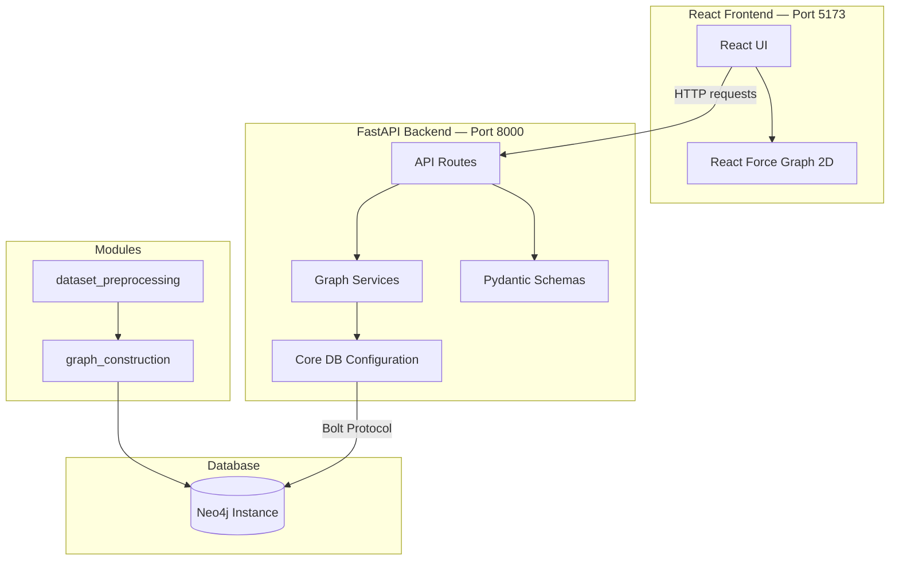

# Patient EHR Graph Representation for Multi-task Learning

A research project that constructs a structured **Knowledge Graph** from patient Electronic Health Records (EHR) and medical ontologies, and exposes it through a full-stack web application for interactive graph exploration.

---

## 📁 Folder Structure

```
.
├── App/
│   ├── backend/                  # FastAPI backend
│   └── frontend/                 # React + Vite frontend
├── modules/
│   ├── dataset_preprocessing/    # Raw data cleaning scripts
│   └── graph_construction/       # Neo4j graph ingestion scripts
├── notebooks/                    # Jupyter exploration notebooks
├── shared_functions/             # Shared utilities (Google Sheets, helpers)
├── secrets/                      # Credentials (gitignored)
├── .env.example                  # Environment variable template
├── .gitignore
└── requirements.txt
```

---

## 🏗️ System Architecture



### Components Summary

| Layer | Technology | Role |
|---|---|---|
| **Frontend** | React + Vite + Vercel | Interactive graph visualization |
| **Backend** | FastAPI + Render | REST API, graph query logic |
| **Database** | Neo4j | Graph storage & traversal |
| **Modules** | Python scripts | Dataset preprocessing & graph ingestion |
| **Shared** | Python utilities | Google Sheets/Drive integration, helpers |

---

## 🚀 Getting Started

### 1. Clone the Repository

```bash
git clone https://github.com/GinHikat/Patient-EHR-Graph-Representation-for-Multi-task-Learning.git
cd Patient-EHR-Graph-Representation-for-Multi-task-Learning
```

### 2. Set Up Environment Variables

Copy the example env file and fill in your credentials:

```bash
cp .env.example .env
```

Then edit `.env` with your actual values:

```ini
# Google API
GOOGLE_API_CREDS=secrets/ggsheet_credentials.json
GOOGLE_SHEET_ID=your_sheet_id
GOOGLE_DRIVE_ID=your_drive_id

# LLM Keys
OPENAI_API_KEY=your_openai_key
GOOGLE_API_KEY=your_google_ai_key

# Neo4j
NEO4J_URI=bolt://localhost:7687
NEO4J_USERNAME=neo4j
NEO4J_AUTH=your_password
NEO4J_DATABASE=neo4j

# HuggingFace
HUGGINGFACE_API_KEY=your_hf_key
```

### 3. Install Python Dependencies

> **Recommended:** Use [`uv`](https://github.com/astral-sh/uv) for fast dependency management.

```bash
# Install uv (if not already installed)
pip install uv

# Install all dependencies
uv pip install -r requirements.txt
```

Or using standard pip:

```bash
pip install -r requirements.txt
```

### 4. Run the Backend

```bash
cd App/backend
python main.py
```

The API will be available at `http://localhost:8000`. Interactive docs at `http://localhost:8000/docs`.

### 5. Run the Frontend

```bash
cd App/frontend
npm install
npm run dev
```

The app will be available at `http://localhost:5173`.

---

## 🧪 Testing the Backend

Run the full test suite (Unit, Ablation, and System tests) with `pytest`:

```bash
cd App/backend
python -m pytest test
```

---

## 📋 Prerequisites

| Requirement | Version |
|---|---|
| Python | 3.10+ |
| Node.js + npm | v16+ |
| Neo4j | Any accessible instance (local, Docker, or Aura) |
| uv *(optional)* | Latest |
